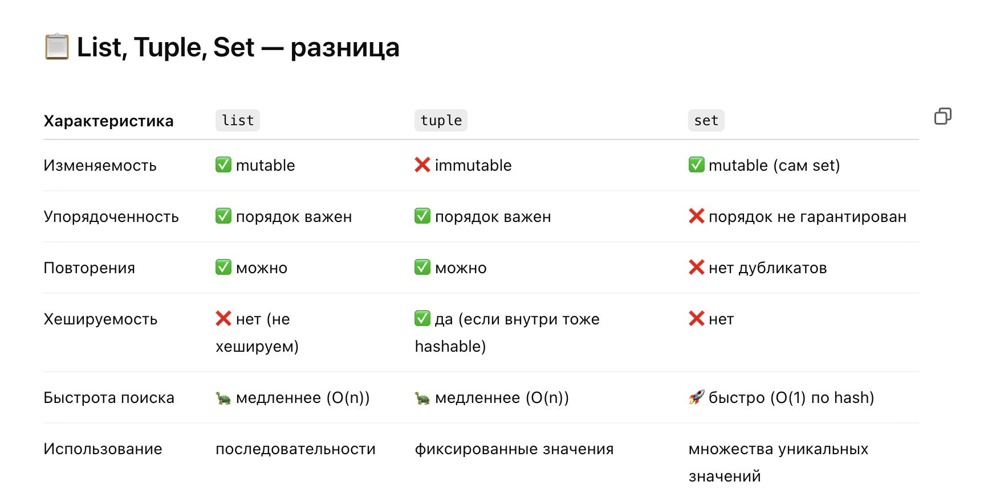
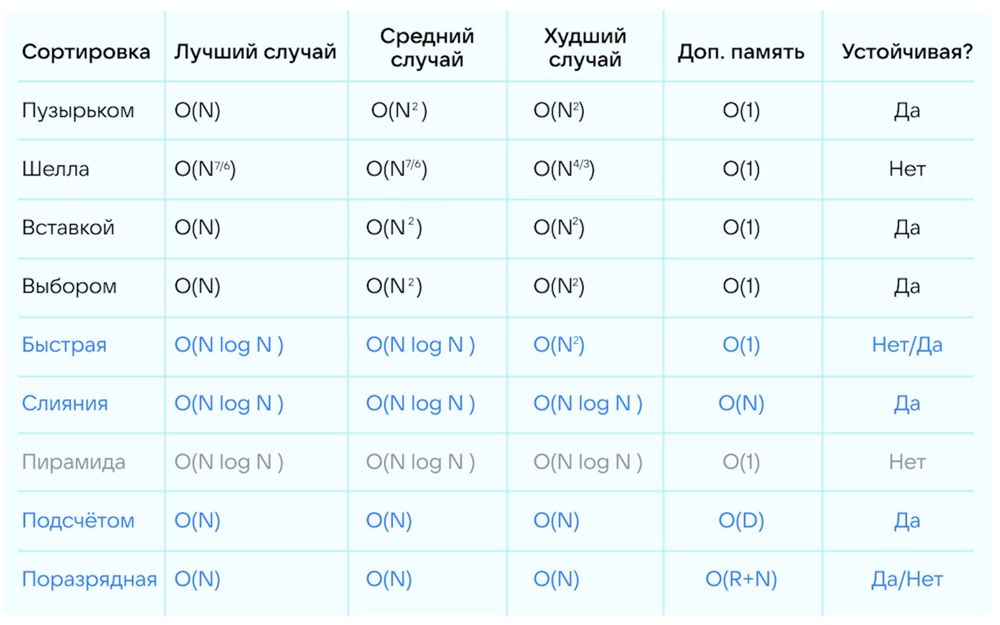

# Вопрос №1 Можешь обьясни разницу между List Tuple Set


## 🧪 Примеры:

```python
# List — изменяемый, упорядоченный
my_list = [1, 2, 3]
my_list.append(4)

# Tuple — неизменяемый, упорядоченный
my_tuple = (1, 2, 3)

# Set — изменяемый, неупорядоченный, только уникальные элементы
my_set = {1, 2, 3, 2}  # будет {1, 2, 3}
my_set.add(4)
```
## 🛠 Когда использовать что?
1. list: когда нужен порядок и возможность изменять (напр. очередь задач)
2. tuple: когда нужна неизменяемость (напр. координаты, ключи словаря)
3. set: когда важна уникальность и быстрое наличие (напр. фильтрация дубликатов)

## 📝 Резюме для собеса:
list — изменяемый, упорядоченный, допускает дубликаты.

tuple — как list, но неизменяемый, можно использовать как ключ в dict.

set — изменяемый, неупорядоченный, содержит только уникальные элементы, очень быстрый для операций "есть/нет".

___

# Вопрос №2 Быстрее ли tuple чем list почему так или не так?

### 🚀 Быстрее ли tuple, чем list?
Да, tuple быстрее, чем list — и по времени доступа, и по потреблению памяти.

### 📌 Почему tuple быстрее:
1. Иммутабельность
tuple — неизменяемый тип.
➤ Python не тратит ресурсы на поддержку операций изменения: append, remove, insert и т.п.
➤ Упрощённая внутренняя структура → меньше накладных расходов.

2. Более компактное хранение
tuple хранит меньше метаинформации.
➤ Экономит память (особенно важно в больших коллекциях).

3. Оптимизации интерпретатора
Python может кешировать и заранее оптимизировать tuple (например, использовать для констант).

🔬 Мини-тест:
```python
import timeit

print(timeit.timeit("x = (1, 2, 3, 4, 5)", number=1000000))  # tuple
print(timeit.timeit("x = [1, 2, 3, 4, 5]", number=1000000))  # list
```

→ Tuple создаётся быстрее.

## 📝 Резюме для собеса:
tuple быстрее и легче, чем list, потому что он неизменяем, требует меньше памяти и не поддерживает методы модификации. Это позволяет Python оптимизировать работу с ним на уровне интерпретатора.

___

# Вопрос №3 Какие типы данных могут входить в set и почему?

### 🔑 Какие типы данных могут входить в set?
**Только хешируемые (immutable) объекты.**

### ✅ Что можно добавить в set:
1. int, float, str, bool, bytes

2. tuple — но только если все его элементы тоже хешируемы

3. frozenset — замороженный set

```python
set1 = {1, "a", (2, 3), True, frozenset([1, 2])}  # всё ок
```

### ❌ Что нельзя:
Нельзя добавлять изменяемые (unhashable) объекты:

1. list
2. dict
3. обычный set

```python
my_set = set()
my_set.add([1, 2, 3])  # ❌ TypeError: unhashable type: 'list'
```

### 📚 Почему так?
Потому что set внутри устроен как хеш-таблица, и для хранения элементов ему нужен хеш-ключ.
Изменяемые объекты могут изменить своё содержимое → нарушается логика поиска.

### 📝 Резюме для собеса:
В set можно добавлять только хешируемые (immutable) типы, такие как int, str, tuple и frozenset.
Это нужно, потому что set использует хеш-таблицу под капотом и требует неизменности для корректной работы.


___
# Вопрос №4 Если мы хотим реализовать свой класс и хотим его поместить в set что надо сделать?

### 🎯 Что нужно, чтобы экземпляр класса можно было добавить в set?
Нужно, чтобы объект был хешируемым — то есть:

1. Реализовать метод `__hash__()`

2. Реализовать метод `__eq__()`

3. Гарантировать неизменность значимых полей после создания

### 📌 Почему?
set использует хеш-таблицу → требует, чтобы объект возвращал стабильный хеш (через __hash__)

__eq__ нужен, чтобы при одинаковом хеше сравнивать объекты правильно

✅ Пример:
```python
class Person:
    def __init__(self, name, age):
        self.name = name
        self.age = age

    def __eq__(self, other):
        return isinstance(other, Person) and self.name == other.name and self.age == other.age

    def __hash__(self):
        return hash((self.name, self.age))

p1 = Person("Alice", 30)
p2 = Person("Alice", 30)

s = {p1, p2}  # ОК: p1 и p2 считаются равными и не дублируются
```

### 🧱 Важно:
Если переопределяешь __eq__, обязательно переопредели __hash__

Не меняй поля, участвующие в __hash__, иначе поведение будет непредсказуемым

### 📝 Резюме для собеса:
Чтобы поместить свой класс в set, нужно реализовать __hash__() и __eq__() и следить, чтобы поля, влияющие на хеш, были неизменяемыми.
Это нужно, чтобы set мог правильно искать и сравнивать объекты внутри хеш-таблицы.


___
# Вопрос №5 Почему int и float по-разному реализуют в случае ключей в dict. И что не так с float и как избежать проблем

### 🔍 Почему int и float по-разному ведут себя как ключи в dict?
#### ✅ int - Надёжный, детерминированный хеш

__hash__() возвращает само значение (например, hash(10) == 10)

#### ⚠️ float - Проблемы из-за погрешностей хранения

Пример:

```python
0.1 + 0.2 == 0.3  # ❌ False
#hash(1.0) == hash(1) → одинаково
```

Но:

```python
a = {1.0: "float", 1: "int"}
print(a)  # {1.0: 'int'} — перезапишет, потому что 1 == 1.0 → True
```

### 🧨 Что не так с float?
1. Погрешность вычислений — float не всегда точно хранит десятичные значения.

2. Сравнение и хеширование могут вести к багам, особенно при близких значениях.

3. float и int могут конфликтовать как ключи, если логика неаккуратно написана.

### ✅ Как избежать проблем:
1. Никогда не используем float как ключ, если:

2. Значения не целые

3. Важна точность

4. Есть вероятность близких значений

### Если нужно точность — используй Decimal из decimal модуля:

```python
from decimal import Decimal

a = {Decimal('0.1') + Decimal('0.2'): "ok"}
print(a[Decimal('0.3')])  # работает корректно
```

Или преобразуй в строки/округляй до нужного количества знаков

### 📝 Резюме для собеса:
int хешируется стабильно, а float подвержен погрешностям и может привести к неожиданным результатам при сравнении и использовании в dict.
Лучше избегать float в качестве ключей, использовать Decimal или строки для точных значений.

___
# Вопрос №6 Что такое малое O в алгоритмах

### 📌 Отличие от большого O:

Обозначение	Значение
```python
O(f(n))	В худшем случае не превышает f(n) (возможно = f(n))
o(f(n))	Строго меньше, асимптотически меньше f(n)
```

### 📝 Резюме для собеса:
Малое O обозначает, что функция растёт строго медленнее, чем другая. 
В отличие от O(f(n)), где допускается равный рост, o(f(n)) исключает равенство — это строгое ограничение сверху.

___
# Вопрос №7 Сортировки

